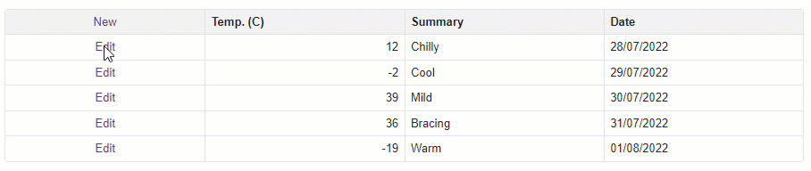

<!-- default badges list -->

<!-- default badges end -->

# Grid for Blazor - How to edit a row on a separate page

The DevExpress Blazor Grid offers multiple data editing options (including inline data editing within row cells). In this example, a separate edit form is used to modify row data.

This example demonstrates how you can:

* Add a Blazor Grid to a project
* Add a command column template with a hyperlink to the edit form (the hyperlink is used to navigate to the edit form. It also passes the key field value to the edit form).
* Edit row data in a separate page and apply changes to the data source.
* Navigate back to the original page.

## Files to Review

* [Index.razor](./CS/DataGridSeparateEditForm/Pages/Index.razor)
* [SeparateEditForm.razor](./CS/DataGridSeparateEditForm/Pages/SeparateEditForm.razor)

## Documentation

[CellDisplayTemplate](https://docs.devexpress.com/Blazor/DevExpress.Blazor.DxGridCommandColumn.CellDisplayTemplate)
<!-- feedback -->
## Does this example address your development requirements/objectives?

 

(you will be redirected to DevExpress.com to submit your response)
<!-- feedback end -->
